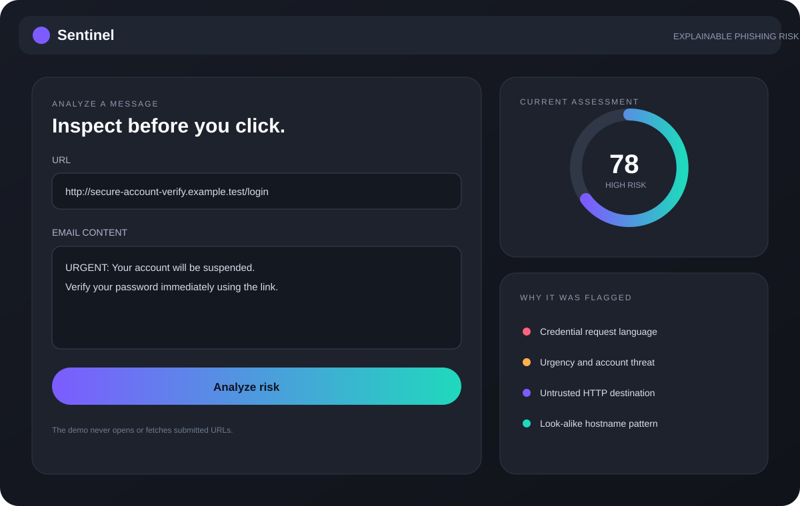
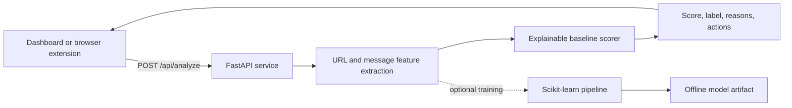

# Sentinel — Real-Time Phishing Detection

[](https://github.com/nityaroshinikandula4/phishing-detection-ml/actions/workflows/ci.yml)


An explainable phishing-risk application that analyzes URL structure and email language, returns a transparent risk score, and includes a Manifest V3 browser-extension prototype.

> **Project status:** active portfolio reference implementation. The included heuristic and tiny training dataset are suitable for demonstrations and learning—not production security decisions.



## Why this project

Phishing tools should do more than return a label. Sentinel exposes the signals behind each result, such as raw IP hosts, unusual subdomain depth, urgency language, credential requests, and risky download patterns. This makes the output reviewable by a user or security analyst.

## Features

- FastAPI REST service with validated request and response models
- URL lexical-feature extraction and explainable baseline scoring
- Email-content signals for urgency, credentials, payments, forms, and links
- Responsive, keyboard-friendly dashboard with an Apple-inspired visual system
- Chrome/Edge Manifest V3 popup that checks the active tab against the local API
- Optional Scikit-learn training script and intentionally small sample data
- Automated API and feature tests with GitHub Actions
- No URL fetching: submitted destinations are never opened by the service

## Architecture



## Run locally

```bash
python -m venv .venv
source .venv/bin/activate            # Windows: .venv\Scripts\activate
pip install -r requirements.txt
uvicorn app.main:app --reload
```

Open `http://127.0.0.1:8000`. Interactive API documentation is available at `/docs`.

## Browser extension

1. Start the API locally on port `8000`.
2. Open `chrome://extensions` or `edge://extensions`.
3. Enable **Developer mode** and choose **Load unpacked**.
4. Select the `extension/` folder.
5. Open a page and select the Sentinel toolbar icon.

The extension requests only active-tab access and local API host permission.

## Train the optional classifier

```bash
python scripts/train_url_model.py
```

The included CSV validates a reproducible training pipeline only. A production classifier would require a large, current, licensed dataset, leakage controls, cross-validation, calibration, drift monitoring, adversarial testing, and trusted reputation feeds.

## API example

```bash
curl -X POST http://127.0.0.1:8000/api/analyze \
  -H 'Content-Type: application/json' \
  -d '{
    "url": "http://secure-account-verify.example.test/login",
    "email_text": "URGENT: verify your password immediately"
  }'
```

## Testing

```bash
pytest -q
```

## Security and privacy notes

- Do not paste confidential messages into a deployment you do not control.
- Heuristics and machine-learning predictions can produce false positives and false negatives.
- The demo does not fetch, resolve, or open submitted URLs.
- Production deployment should add rate limits, abuse controls, authentication for administrative functions, observability, retention controls, and threat-intelligence enrichment.

## Author

**Nitya Roshini Kandula** — Java Full Stack Developer with enterprise experience in REST APIs, relational data workflows, authentication-related changes, testing, debugging, and technical documentation.

[LinkedIn](https://www.linkedin.com/in/nitya-roshini-kandula-a44335283/) · [GitHub](https://github.com/nityaroshinikandula4)
